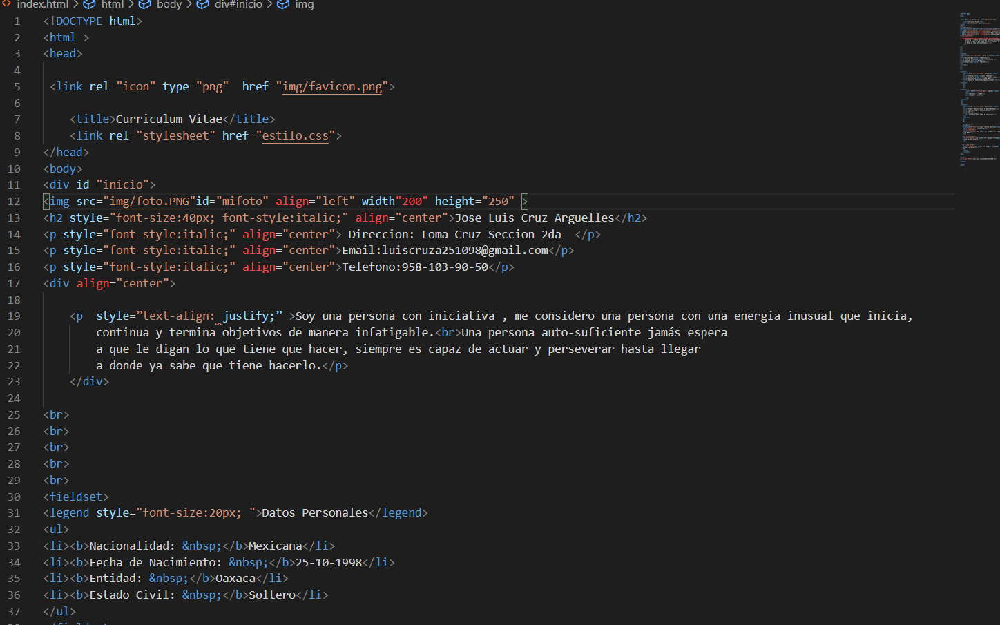
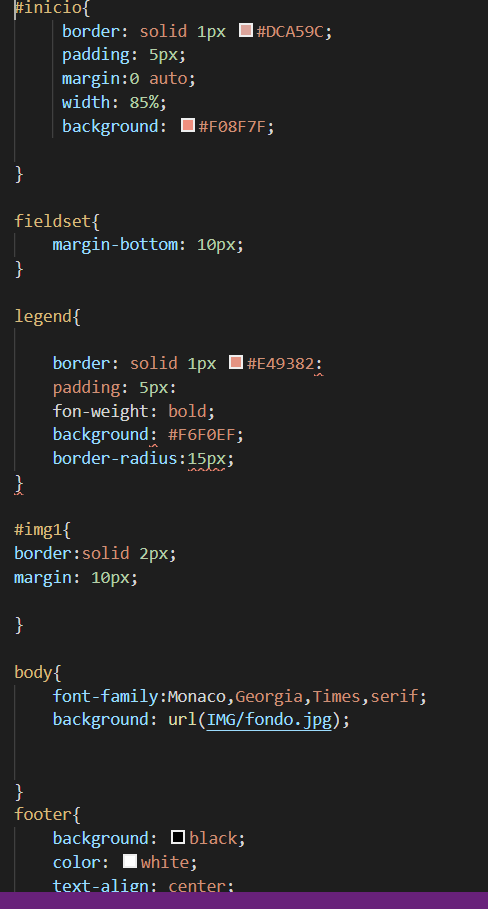
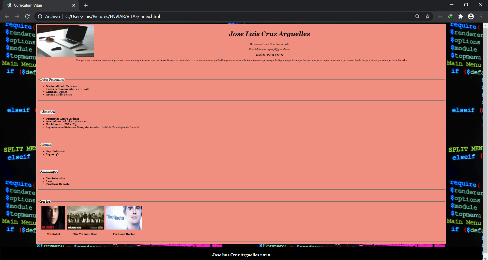
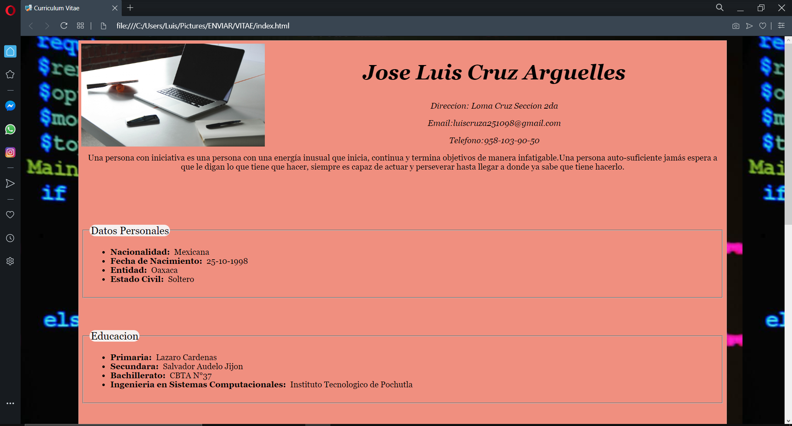
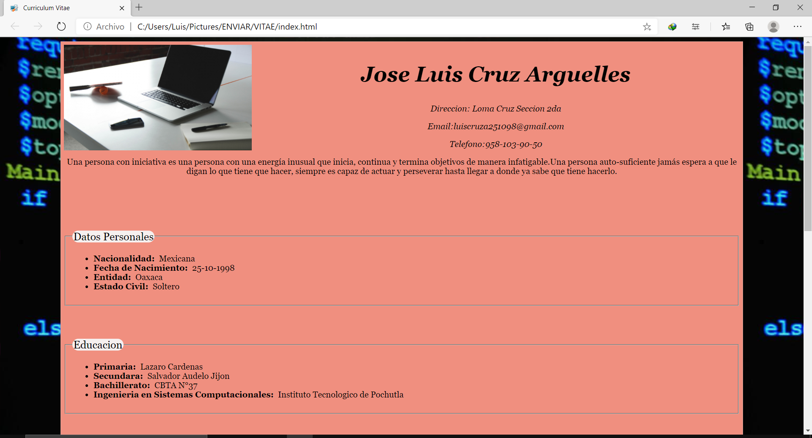

# Práctica 1. Curriculum Vitae
## Instrucciones
### Para poder ejecutar este curriculum vitae tienes que dar doble clic al archivo que se encuentra en la carpeta VITAE  de este repositorio y ejecutar el archivo "index.html".
## Lenguajes de marcado
 ### Para poder realizar esta practica se hizo uso de  HTML junto a CSS en el editor de Visual Studio code

# Codigo  HTML

# Parte del codigo  CSS

# Captura de pantallas en diferentes navegadores para visualizar cad uno de ellos

## Chrome

### Visualizacion

## Opera

### Con vista con el navegador Opera

## Edge
### Con vista con el navegador Edge

